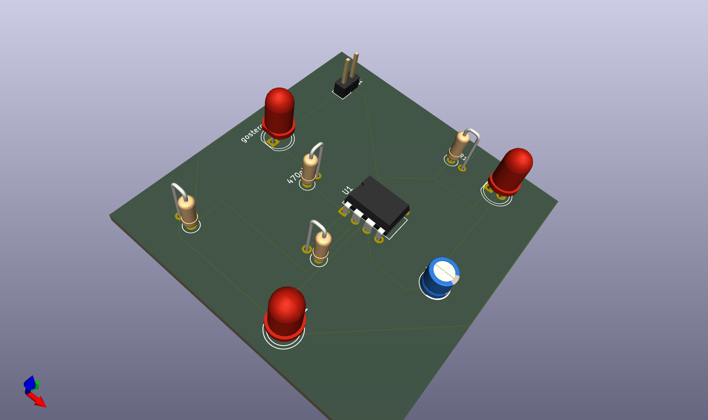

# First PCB Design: Pulse Sensor

This project is my first electronic circuit design created using KiCad. I designed a finger pulse sensor based on the LM358 operational amplifier.

## Project Content
- **Schematic:** `pulse_sensor.kicad_sch`
- **PCB Design:** `pulse_sensor.kicad_pcb`
- **Manufacturing Files:** `Gerber.zip`

## What I Learned
- Creating schematic symbols and assigning footprints.
- Routing tracks on PCB and creating copper pours.
- Preparing Gerber and Drill files for manufacturing.
